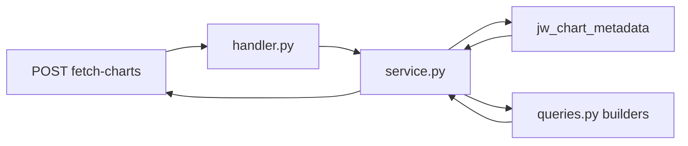

# fetch-charts

Near-real-time proof-points charts: Databricks metadata drives **which** charts
render; `query_library/queries.py` holds **all SQL** for chart values.

## Request flow



1. **Metadata** — `metadata.py` loads every chart row for
   `(dashboard, designation, view)` from `jw_chart_metadata`.
2. **Chart data** — `service.py` runs SQL from `query_library/queries.py` (batch +
   parallel fetch) and parses rows into the UI payload.
3. **Response** — doughnut/bar objects with `chartId`, `labels`, `data`, etc.

No chart data is cached; each request queries Databricks live.

## Directory layout

| Path | Role |
|------|------|
| `handler.py` | POST `fetch-charts` entry point |
| `service.py` | Orchestration, batch fetch, payload assembly |
| `metadata.py` | Live metadata query |
| `chart_catalog.py` | Static list of charts `(chart_id, tier, view, type, name)` — edit when adding charts |
| `view_catalog.py` | Catalog → `ChartMetadata` for parallel prefetch |
| `result_parser.py` | SQL rows → `labels`, `data`, `centerLines`, … |
| `query_library/queries.py` | **All chart SQL — this is where you edit queries** |
| `query_library/chart_registry.py` | Generated nested map (name → chart_id); do not hand-edit |
| `query_library/registry.py` | Resolves `chart_id` + timeline → builder function |
| `query_library/filters.py` | Dashboard filter → SQL `WHERE` fragments |
| `query_library/generate_queries_file.py` | Regenerates `chart_registry.py` + query stubs |
| `verify_live.py` | Live smoke test across all tier/view/timeline combos |

## Chart identity and query lookup

Charts are located in three related structures:

### 1. `chart_catalog.py` — human reference

Tuple per chart: `(chart_id, designation, view, chart_type, chart_name)`.

Example:

```python
("117", "tier-1", "quality", "doughnut", "Groups Meeting External Quality Certification Criteria"),
```

Use this file to look up **chart_id** from tier + view + name.

### 2. `chart_registry.py` — generated nested map

```
dashboard → designation (tier) → view → timeline → chart name → chart_id
```

Used as a **fallback** when `chart_id` is missing from context. Regenerated from
`chart_catalog.py`; do not edit manually.

### 3. `queries.py` — SQL builders keyed by `(chart_id, timeline)`

At runtime, lookup prefers **stable `chart_id` from metadata**, then timeline:

```
(chart_id, timeline) → build_query_chart_<id>_<timeline>() → SQL string
```

Display-name changes in the metadata table do **not** break query resolution.

## Replacing SQL for an existing chart

**Only edit:** `query_library/queries.py`

### Step 1 — Find the chart_id

From `chart_catalog.py` or the metadata table. Chart IDs:

| Tier | View | IDs |
|------|------|-----|
| ccd | volume | 1–2 |
| ccd | spend | 3–8 |
| ccd | utilization | 9–12 |
| ccd | savings | 13–14 |
| ccd | quality | 15–20 |
| ccd | turnover-disruption | 21–22 |
| tier-1 | (same views) | 101–122 |

### Step 2 — Open the matching builder

Search `queries.py` for `build_query_chart_<id>_ytd` or `_yoy`:

```python
# Chart 117 — Groups Meeting External Quality Certification Criteria (tier-1 / quality / YOY)
def build_query_chart_117_yoy(context: ChartQueryContext) -> str:
    """SQL for chart_id=117 (YOY). Replace this SQL when ready."""
    return _default_query(context)   # ← replace this
```

Each chart has **two** functions: `_ytd` and `_yoy`.

### Step 3 — Return warehouse SQL

Replace the body with SQL returning these columns:

| column | usage |
|--------|--------|
| `row_kind` | `'slice'` or `'center'` |
| `sort_order` | order within slice/center group |
| `label` | doughnut slice label / bar x-axis label |
| `data_value` | numeric value |
| `series_index` | bar series index (0, 1, …) |
| `center_line` | doughnut center text line |
| `hover_message` | doughnut tooltip (use `\n` for second line) |

**Filters** — append dashboard filter clauses in `WHERE`:

```python
from features.fetch_charts.query_library.filters import build_filter_clause_for_context

def build_query_chart_3_ytd(context: ChartQueryContext) -> str:
    filter_clause = build_filter_clause_for_context(context)
    return f"""
SELECT sort_order, row_kind, label, data_value, series_index, center_line, hover_message
FROM your_schema.your_table
WHERE designation = '{context.designation}'{filter_clause}
ORDER BY sort_order
"""
```

**Context fields available:** `context.dashboard`, `context.designation`,
`context.view`, `context.timeline`, `context.chart_name`, `context.chart_id`,
`context.chart_type`, `context.filters`.

### Do not edit (unless adding charts)

- `QUERY_BUILDERS` dict at the bottom of `queries.py` — regenerated by the script
- `chart_registry.py` — regenerated
- `registry.py` — resolution logic only

## Adding a new chart

1. Insert the row in `jw_chart_metadata` (Databricks).
2. Add a tuple to `CHART_CATALOG` in `chart_catalog.py`:
   ```python
   ("123", "ccd", "spend", "doughnut", "My New Chart"),
   ```
3. Regenerate stubs:
   ```bash
   cd jakshwealth-api
   python3 lambda/jw_secure_data/features/fetch_charts/query_library/generate_queries_file.py
   ```
4. Replace placeholder SQL in the new `build_query_chart_123_ytd` / `_yoy` functions.
5. Run tests:
   ```bash
   python -m pytest lambda/jw_secure_data/tests/test_fetch_charts_service.py -q
   ```
6. Optional live check:
   ```bash
   python lambda/jw_secure_data/features/fetch_charts/verify_live.py
   ```

## API contract

**Request** (POST `/jw-api/secure-data/fetch-charts`):

```json
{
  "dashboard": "proof-points",
  "designation": "ccd",
  "viewId": "spend",
  "timeline": "ytd",
  "filters": {
    "crrMarket": [],
    "providerNetwork": [],
    "specialtyCategory": [],
    "specialtyType": [],
    "episodeCategory": [],
    "memberProduct": []
  }
}
```

**Response:** `{ "charts": [ … ] }` — one object per metadata row, sorted by
`sequence`. Doughnut charts include `title`, `explanation`, `centerLines`,
`hoverMessages`.

## Performance notes

- Chart-data queries for a view run as a **single batch** (`UNION ALL`) where possible.
- Metadata fetch and chart-data fetch run **in parallel** (catalog kick-starts SQL
  without waiting on metadata).
- Databricks connections are reused per thread; no response caching.
